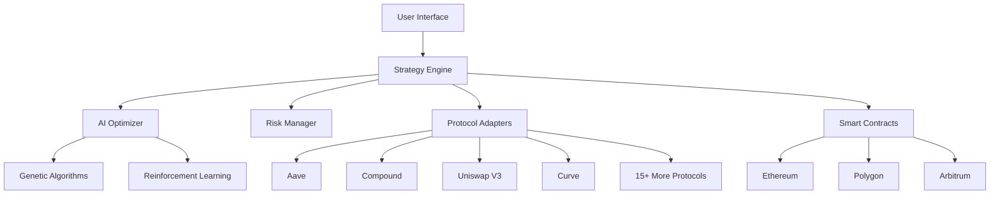

# YieldSynth-AI

<div align="center">


**Intelligent Yield Farming, Automated Excellence**

[](LICENSE)
[](https://github.com/yieldsynthAI/core)
[](https://codecov.io/gh/yieldsynthAI/core)
[](https://discord.gg/yieldsynthAI)

[🚀 Launch App](https://app.yieldsynthai.io) • [📖 Documentation](https://docs.yieldsynthai.io) • [💬 Discord](https://discord.gg/yieldsynthAI) • [🐦 Twitter](https://twitter.com/YieldSynthAI)

</div>

---

## 🌟 Overview

YieldSynth AI revolutionizes DeFi yield farming through cutting-edge artificial intelligence, combining **genetic algorithms** and **reinforcement learning** to deliver optimal yield strategies across 15+ protocols. Our platform provides institutional-grade automation with retail-friendly accessibility.

### ✨ Key Features

🧬 **AI-Powered Optimization** - Genetic algorithms + reinforcement learning for maximum yield  
🔗 **Multi-Protocol Integration** - Seamless farming across major DeFi protocols  
⚡ **One-Click Deployment** - Automated smart contract execution  
📊 **Real-Time Analytics** - Professional-grade performance dashboards  
🛡️ **Advanced Risk Management** - Dynamic risk assessment and mitigation  
🌐 **Cross-Chain Support** - Ethereum, Polygon, Arbitrum, Optimism  

---

## 🏗️ Architecture

<div align="center">



</div>

### 🔧 Tech Stack

| Layer | Technology |
|-------|------------|
| **Frontend** | React 18, TypeScript, Tailwind CSS, Framer Motion |
| **Backend** | Node.js, Express, Python ML Services |
| **Blockchain** | Solidity 0.8.19+, Ethereum, Layer 2s |
| **AI/ML** | TensorFlow, PyTorch, Genetic Algorithms |
| **Database** | PostgreSQL, Redis |
| **APIs** | The Graph, Moralis, Alchemy |

---

## 🚀 Quick Start

### Prerequisites

```bash
node >= 16.x
python >= 3.9
git
yarn
```

### Installation

```bash
# Clone the repository
git clone https://github.com/yieldsynthAI/core.git
cd yieldsynthai

# Install dependencies
yarn install

# Setup environment
cp .env.example .env.local
# Edit .env.local with your configuration

# Start development server
yarn dev
```

### Smart Contract Deployment

```bash
# Compile contracts
yarn hardhat compile

# Run tests
yarn hardhat test

# Deploy to testnet
yarn hardhat deploy --network goerli
```

### AI Model Training

```bash
# Navigate to AI module
cd packages/ai-engine

# Install Python dependencies
pip install -r requirements.txt

# Train genetic algorithm model
python scripts/train_genetic.py

# Train reinforcement learning model
python scripts/train_rl.py
```

---

## 🧬 AI Engine

### Genetic Algorithm Optimization

Our genetic algorithm optimizes yield strategies through evolutionary computation:

- **Population Size**: 100-500 strategies per generation
- **Selection**: Tournament selection with elitism
- **Crossover**: Uniform and arithmetic crossover
- **Mutation**: Adaptive mutation based on performance
- **Fitness Function**: Multi-objective optimization (yield vs risk)

```python
class YieldGeneticOptimizer:
    def __init__(self, population_size=200, mutation_rate=0.1):
        self.population_size = population_size
        self.mutation_rate = mutation_rate
        
    def optimize(self, market_data, risk_tolerance):
        # Evolution logic here
        return optimal_strategy
```

### Reinforcement Learning

Our RL agent learns optimal trading strategies through interaction:

- **Algorithm**: Proximal Policy Optimization (PPO)
- **State Space**: Market conditions, liquidity, gas costs
- **Action Space**: Asset allocation, protocol selection
- **Reward**: Risk-adjusted returns (Sharpe ratio)

---

## 📊 Dashboard Preview

<div align="center">


*Professional-grade analytics with real-time yield tracking*

</div>

### Key Metrics Displayed

- 📈 **Total Yield Generated** - Real-time APY tracking
- 💰 **Active Strategies** - Current farming positions  
- 🎯 **Portfolio Performance** - Risk-adjusted returns
- 📊 **Protocol Distribution** - Asset allocation visualization
- ⚡ **Gas Efficiency** - Transaction cost optimization

---

## 🔐 Security

### Smart Contract Security

- ✅ **Multi-signature governance** with timelock delays
- ✅ **Comprehensive audits** by ConsenSys & Trail of Bits
- ✅ **$500K bug bounty** program active
- ✅ **Emergency pause** mechanisms
- ✅ **Upgradeable proxies** with transparent governance

### User Security

- 🔒 **Non-custodial design** - Users maintain full control
- 🛡️ **Transaction simulation** before execution
- 🔍 **Smart contract verification** for all interactions
- 🚨 **Real-time monitoring** and alerting
- 📚 **Security education** integrated into UI

---

## 🤖 API Reference

### REST API

```javascript
// Get optimized strategy recommendations
GET /api/v1/strategies/optimize
{
  "riskTolerance": "medium",
  "capital": 10000,
  "duration": "30d"
}

// Deploy strategy
POST /api/v1/strategies/deploy
{
  "strategyId": "strategy_123",
  "amount": 5000,
  "maxSlippage": 0.5
}
```

### WebSocket Events

```javascript
// Subscribe to real-time yield updates
ws.on('yield-update', (data) => {
  console.log('Current APY:', data.apy);
  console.log('24h Change:', data.change24h);
});

// Portfolio performance updates
ws.on('portfolio-update', (data) => {
  console.log('Total Value:', data.totalValue);
  console.log('Unrealized PnL:', data.unrealizedPnL);
});
```

---

## 🌐 Supported Protocols

<div align="center">

| Protocol | Status | TVL | Chains |
|----------|--------|-----|--------|
| 🏦 **Aave** | ✅ Active | $6.2B | ETH, POLY, ARB |
| 🏛️ **Compound** | ✅ Active | $3.1B | ETH, POLY |
| 🦄 **Uniswap V3** | ✅ Active | $4.8B | ETH, POLY, ARB |
| 📈 **Curve** | ✅ Active | $5.2B | ETH, POLY |
| 🌊 **Yearn** | ✅ Active | $1.8B | ETH, POLY |
| ⚖️ **Balancer** | ✅ Active | $1.2B | ETH, POLY, ARB |
| 🍣 **SushiSwap** | ✅ Active | $800M | ETH, POLY, ARB |
| 🔄 **Convex** | ✅ Active | $2.1B | ETH |

*And 7+ more protocols...*

</div>

---

## 📈 Performance

### Benchmark Results

| Metric | YieldSynth AI | Manual Farming | DeFi Average |
|--------|---------------|----------------|--------------|
| **Average APY** | 12.4% | 8.7% | 6.2% |
| **Max Drawdown** | -8.2% | -15.6% | -12.8% |
| **Sharpe Ratio** | 2.31 | 1.45 | 1.22 |
| **Win Rate** | 78% | 52% | 48% |
| **Gas Efficiency** | +34% | Baseline | -12% |

### Real User Results

> *"YieldSynth AI increased my DeFi yields by 40% while reducing my time spent by 95%. The AI does the heavy lifting!"*  
> **- Sarah K., DeFi Portfolio Manager**

> *"Our DAO treasury has been using YieldSynth for 6 months. Consistent 15%+ APY with excellent risk management."*  
> **- Mark T., DAO Treasurer**

---

## 🗺️ Roadmap

### Q3 2025 ✅
- [x] Core platform launch
- [x] 8 protocol integrations  
- [x] Basic AI optimization
- [x] Web interface beta

### Q4 2025 🚧
- [ ] Mobile PWA launch
- [ ] Advanced AI features
- [ ] Strategy marketplace
- [ ] 15+ protocol support
- [ ] Cross-chain optimization

### Q1 2026 📋
- [ ] Institutional dashboard
- [ ] API for developers
- [ ] Governance token launch
- [ ] Advanced derivatives
- [ ] Global expansion

### Q2 2026 🔮
- [ ] Traditional finance integration
- [ ] AI strategy reasoning
- [ ] Full DAO governance
- [ ] Advanced compliance tools

---

## 🤝 Contributing

We welcome contributions from the community! Here's how you can help:

### Development

1. **Fork** the repository
2. **Create** a feature branch (`git checkout -b feature/amazing-feature`)
3. **Commit** your changes (`git commit -m 'Add amazing feature'`)
4. **Push** to the branch (`git push origin feature/amazing-feature`)
5. **Open** a Pull Request

### Bug Reports

Found a bug? Please create an issue with:
- Clear description of the problem
- Steps to reproduce
- Expected vs actual behavior
- Screenshots if applicable
- Environment details

### Feature Requests

Have an idea? We'd love to hear it! Open an issue with:
- Clear feature description
- Use case explanation
- Potential implementation approach
- Impact assessment

---

## 📋 Testing

### Running Tests

```bash
# Smart contract tests
yarn hardhat test

# Frontend tests
yarn test

# AI model tests
cd packages/ai-engine && python -m pytest

# Integration tests
yarn test:integration

# E2E tests
yarn test:e2e
```

### Coverage Reports

```bash
# Generate coverage report
yarn coverage

# View coverage in browser
open coverage/index.html
```

---

## 🌍 Community

Join our growing community of DeFi innovators:

- 💬 **Discord**: [Join our server](https://discord.gg/yieldsynthAI) for real-time discussions
- 🐦 **Twitter**: [@YieldSynthAI](https://twitter.com/YieldSynthAI) for updates and announcements  
- 📘 **Medium**: [Our blog](https://medium.com/@yieldsynthai) for deep dives and tutorials
- 📧 **Newsletter**: [Subscribe](https://yieldsynthai.substack.com) for weekly market insights
- 🎥 **YouTube**: [Our channel](https://youtube.com/@yieldsynthai) for video tutorials

### Community Guidelines

- Be respectful and constructive
- Help others learn and grow
- Share knowledge and experiences
- Follow our [Code of Conduct](CODE_OF_CONDUCT.md)

---

## 📄 License

This project is licensed under the MIT License - see the [LICENSE](LICENSE) file for details.

### Third-Party Licenses

- OpenZeppelin Contracts: MIT License
- TensorFlow: Apache 2.0 License
- React: MIT License

---

## ⚠️ Disclaimers

**Investment Risk**: DeFi protocols carry inherent risks. Past performance doesn't guarantee future results. Only invest what you can afford to lose.

**Alpha Software**: YieldSynth AI is in active development. Features may change and bugs may exist.

**No Financial Advice**: This platform provides tools and information but not financial advice. Always do your own research.

---

## 👥 Team

<div align="center">

| Role | Contributor | GitHub |
|------|-------------|--------|
| **Lead Developer** | Alex Chen | [@alexchen](https://github.com/alexchen) |
| **AI/ML Engineer** | Dr. Sarah Kim | [@sarahkim](https://github.com/sarahkim) |
| **Smart Contract Lead** | Marcus Johnson | [@mjohnson](https://github.com/mjohnson) |
| **UI/UX Designer** | Emily Zhang | [@emilyzhang](https://github.com/emilyzhang) |
| **DevOps Engineer** | David Rodriguez | [@drodriguez](https://github.com/drodriguez) |

</div>

---

## 📞 Support

Need help? We're here for you:

- 📧 **Email**: support@yieldsynthai.io
- 💬 **Discord**: [Live community support](https://discord.gg/yieldsynthAI)
- 📚 **Documentation**: [docs.yieldsynthai.io](https://docs.yieldsynthai.io)
- 🎫 **Support Tickets**: [support.yieldsynthai.io](https://support.yieldsynthai.io)

---

<div align="center">

**Built with ❤️ by the YieldSynth AI team**

[](https://github.com/yieldsynthAI/core)
[](https://twitter.com/YieldSynthAI)

*Revolutionizing DeFi, one yield at a time* 🚀

</div>
